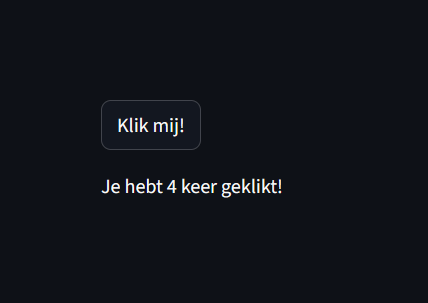
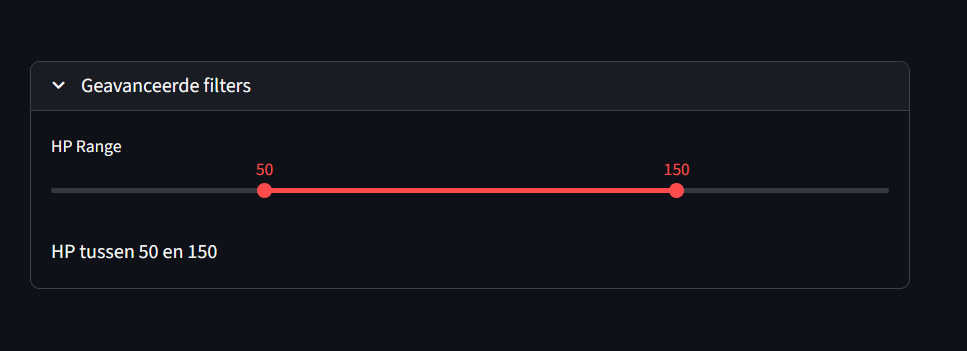

<h1 style="font-size: 2.5rem;">Streamlit: Snel & Makkelijk Visualiseren</h1>

<h3 style="font-size: 1.2rem;">Deel 1: Overzicht van Streamlit</h3>

<br>

<div style="display: flex; justify-content: center; align-items: center; gap: 5vw; font-size: 1.1rem; flex-wrap: wrap;">
  <div style="text-align: center;">
    <strong>Sander Kools</strong><br>
    <i>Pokemon Trainer</i>
  </div>
  <div style="text-align: center;">
    <strong>Dennis Stoel</strong><br>
    <i>Pokemon Professor</i>
  </div>
  <div style="text-align: center;">
    <strong>Dervis van Leersum</strong><br>
    <i>Pokemon Gym Leader</i>
  </div>
</div>

<br>

<div style="text-align: center;">
  
</div>

---

## Wat is Streamlit?

**Een Python framework om data scripts om te zetten in interactieve web apps**

<div style="font-size: 1.1rem; margin: 8vh 0; text-align: left;">

📚 **Streamlit Python-bibliotheek** — snel interactieve visualisaties en analyses<br>
📊 **Geen HTML, CSS of JavaScript nodig** — focus op data en logica<br>
⚡ **Van script naar shareable app in minuten** — gemak<br>
🐍 **Pure Python** — gebruik je bestaande skills<br>
🔄 **Live updates** — elke code wijziging direct zichtbaar

</div>

<div style="font-size: 1.1rem; font-style: italic; text-align: center; margin-top: 4vh;">

> *"If you can write Python, you can build a web app"*

</div>

---

## Waarom Streamlit?

<div style="font-size: 0.45em; margin: 50px 0px 0px 0px; text-align: left;">

### 👨‍🔬 **Voor Data Scientists**

- Snel een prototype model kunnen tonen aan stakeholders
- Exploratory data analysis delen met collega's
- Geen wachten op frontend developers 😶

</div>
<div style="font-size: 0.45em; margin: 30px 0px 0px 0px; text-align: left;">

### 👨‍💻 **Voor Software Engineers**  

- Interne tools & dashboards in uren i.p.v. weken
- MVPs en proof-of-concepts
- Admin panels zonder React/Vue/Angular

</div>
<div style="font-size: 0.45em; margin: 30px 0px 40px 0px; text-align: left;">

### 👥 **Voor Teams**

- Beheer data access (iedereen kan je analyses gebruiken)
- Live demos tijdens meetings
- Self-service analytics platforms

</div>
<div style="font-size: 0.55em;">

> ✅ **Perfect voor:** Internal tools, data apps, demos, prototypes, MVPs

</div>

---

## Bijvoorbeeld
<br>

<table>
<tr>
<td style="width: 50%; vertical-align: top; padding: 10px;">
Snippet
</td>
<td style="width: 40%; vertical-align: top; padding: 10px;">
Result
</td>
</tr>
<tr>
<td style="width: 40%; vertical-align: top; padding: 10px;">

##### 📝 Code:
```python
import streamlit as st
st.title("Hallo, Streamlit!")
st.line_chart([1, 2, 3, 4, 5])
```

##### 🏃 Run app:
```bash
streamlit run app.py
```

</td>
<td style="width: 40%; vertical-align: top; padding: 10px;">

<div style="flex: 1; text-align: center;">
  
</div>

</td>
</tr>
</table>

---

## ⚠️ Wanneer NIET Streamlit?

<div style="font-size: 0.7em; margin: 60px 0px 60px 0px; text-align: left;">

❌ **High-traffic publieke apps** (veel concurrent users)  
❌ **Complexe state management** (multi-user real-time collaboration)  
❌ **Pixel-perfect custom UI** (complexe design specs)  
❌ **Mobile-first apps** (responsive, maar niet optimaal)

</div>

---

## Streamlit Execution Model
#### *Dit is CRUCIAAL om te begrijpen!*

<div style="font-size: 0.8em; margin: 40px 0px 40px 0px; text-align: left;">

#### ⚡ Het Belangrijkste Principe:

</div>
<div style="font-size: 0.6em;">

> **Streamlit re-runs je hele script bij elke interactie**  
> Van boven naar beneden, telkens opnieuw

</div>
<div style="font-size: 0.8em; margin: 40px 0px 40px 0px; text-align: left;">

🖱️ **Elke widget click** = complete re-run  
⌨️ **Elke input change** = complete re-run  
📁 **Elke file upload** = complete re-run  

</div>
<div style="font-size: 0.4em; margin: 40px 0px 10px 0px;;">

> Meer hierover in de volgende presentatie...

</div>

---

## 🚀 Start met Streamlit

<div style="font-size: 0.65em; margin: 30px 0px 0px 0px;">

### 📦 **Installatie**
```bash
uv sync
```

</div>
<div style="font-size: 0.65em; margin: 30px 0px 0px 0px;">

### 📝 **Maak een module:** `app.py`
```python
import streamlit as st

st.write("Hallo workshop! 👋")
```

</div>
<div style="font-size: 0.65em; margin: 30px 0px 0px 0px;">

### ▶️ **Run het**
```bash
uv run streamlit run app.py
```

</div>
<div style="font-size: 0.65em; margin: 50px 0px 0px 0px;">

**Browser opent (automatisch) op** `http://localhost:8501` 🎉

</div>


---

### 🏗️ Architectuur Basics

<div style="font-size: 0.7em; margin: 30px 0px;">

<table style="width: 100%; border-collapse: separate; border-spacing: 20px;">
<tr>
<td style="width: 40%; background: #2779d6; padding: 30px; border-radius: 10px; border: 2px solid #4a90e2;">

### 🌐 **Browser (Frontend)**

<div style="font-size: 0.9em; margin-top: 20px; text-align: left;">

✨ UI Rendering  
⌨️ User Input  
🖱️ Interactivity  
📱 Responsive Layout  

</div>

</td>

<td style="width: 20%; text-align: center; vertical-align: middle; font-size: 2em;">

**↔️**

<div style="font-size: 0.4em; margin-top: 10px;">
WebSocket
</div>

</td>

<td style="width: 40%; background: #c58d38; padding: 30px; border-radius: 10px; border: 2px solid #ff9800;">

### 🐍 **Python (Backend)**

<div style="font-size: 0.9em; margin-top: 20px; text-align: left;">

⚙️ Script Execution  
🧮 Data Processing  
💾 State Management  
📊 Compute Work  

</div>

</td>
</tr>
</table>

🔌 **WebSocket verbinding:** real-time updates  
🖥️ **Server-side rendering:** Python doet het zware werk  
📡 **Auto-reconnect:** verbinding verloren? Herstelt automatisch  

💡 **Voor jou:** Schrijf gewoon Python, Streamlit regelt de rest!

</div>

---

### The App Chrome

<table>
<tr>
<td style="width: 50%; vertical-align: top; padding: 10px;">
Built-in dev tools
</td>
<td style="font-size: 0.55em; width: 40%; padding: 10px;">
in the top right corner
</td>
</tr>
<tr>
<td style="font-size: 0.55em; width: 40%; vertical-align: top; padding: 10px;">

⚙️ **Settings** 
  * theme, run on save, wide mode

🔄 **Rerun** 
  * handmatig hertrigger

🗑️ **Clear cache** 
  * verwijder gecachte data

📹 **Record screencast** 
  * maak een demo video

🐛 **Print** 
  * print de pagina

</td>
<td style="width: 40%; vertical-align: top; padding: 10px;">

<div style="flex: 1; text-align: center;">
  
</div>

</td>
</tr>
</table>

---

## 🧩 Core Widgets - display & Input

<table>
<tr>
<td style="width: 50%; vertical-align: top; padding: 10px;">
📊 Data Weergeven
</td>
<td style="font-size: 0.55em; width: 40%; padding: 10px;">

</td>
</tr>
<tr>
<td style="font-size: 0.55em; width: 40%; vertical-align: top; padding: 10px;">

```python
import streamlit as st
import pandas as pd

# Text
st.write("Simpelste manier om iets te tonen")
st.title("🏆 Grote titel")
st.header("📌 Header")
st.subheader("📍 Subheader")
st.markdown("**Bold** en *italic* tekst")

# ✨ Magic!
st.file_uploader("Upload pokemon...")

# Data
df = pd.DataFrame(
  {
    "pokemon": ["Pikachu", "Charizard", "Bulbasaur"], 
    "hp": [35, 78, 45]
  }
)
st.dataframe(df)  # 📊 Interactieve tabel (sorteerbaar!)
st.table(df)      # 📋 Static tabel

# Metrics: 📈 Met delta
st.metric("Totaal Pokemon", "151", "+1 nieuwe")
```
</td>
<td style="width: 40%; vertical-align: top; padding: 10px;">

<div style="flex: 1; text-align: center;">
  
</div>

</td>
</tr>
</table>
---

## 🧩 Core Widgets - Visualize

<table>
<tr>
<td style="width: 50%; vertical-align: top; padding: 10px;">
📊 Bar Chart
</td>
<td style="font-size: 0.55em; width: 40%; padding: 10px;">

</td>
</tr>
<tr>
<td style="font-size: 0.55em; width: 40%; vertical-align: top; padding: 10px;">

```python
import streamlit as st
import pandas as pd

# Create DataFrame
data = pd.DataFrame({
    "stad": [
      "Amsterdam", "Rotterdam", "Utrecht", "Eindhoven"
    ],
    "temperatuur": [15, 17, 14, 16]
})

# Create a dropdown box
selected_city = st.selectbox(
    "Kies een stad:",
    data["stad"].unique()
)
# filter on selection
filtered_data = data[data["stad"] == selected_city]

st.write(
    f"Temperatuur in {selected_city}: {
        filtered_data['temperatuur'].values[0]
    }°C"
)
# Plot a bar chart
st.bar_chart(filtered_data.set_index("stad"))
```
</td>
<td style="width: 40%; vertical-align: top; padding: 10px;">

<div style="flex: 1; text-align: center;">
  
</div>

</td>
</tr>
</table>

---

## 🧩 Core Widgets - Visualize

<table>
<tr>
<td style="width: 50%; vertical-align: top; padding: 10px;">
📊 Matplotlib
</td>
<td style="font-size: 0.55em; width: 40%; padding: 10px;">

</td>
</tr>
<tr>
<td style="font-size: 0.55em; width: 40%; vertical-align: top; padding: 10px;">

```python
import streamlit as st
import matplotlib.pyplot as plt
import numpy as np

# Genereer willekeurige data
data = np.random.normal(0, 1, 1000)

# Maak een histogram
fig, ax = plt.subplots()
ax.hist(data, bins=30, edgecolor='black')
ax.set_title("Normale Verdeling")
ax.set_xlabel("Waarde")
ax.set_ylabel("Frequentie")

# Toon de grafiek in Streamlit
st.pyplot(fig)
```
</td>
<td style="width: 40%; vertical-align: top; padding: 10px;">

<div style="flex: 1; text-align: center;">
  
</div>

</td>
</tr>
</table>

---

## 🧩 Core Widgets - Visualize

<table>
<tr>
<td style="width: 50%; vertical-align: top; padding: 10px;">
📊 Plotly
</td>
<td style="font-size: 0.55em; width: 40%; padding: 10px;">

</td>
</tr>
<tr>
<td style="font-size: 0.55em; width: 40%; vertical-align: top; padding: 10px;">

```python
import streamlit as st
import plotly.express as px
import pandas as pd

# Voorbeeld data
df = pd.DataFrame({
    "x": [1, 2, 3, 4, 5],
    "y": [10, 11, 8, 13, 9],
    "categorie": ["A", "B", "A", "C", "B"]
})

# Maak een interactieve scatter plot
fig = px.scatter(
  df,
  x="x", y="y", 
  color="categorie",
  title="Interactieve Scatter Plot"
)

# Toon de grafiek in Streamlit
st.plotly_chart(fig)
```
</td>
<td style="width: 40%; vertical-align: top; padding: 10px;">

<div style="flex: 1; text-align: center;">
  
</div>

</td>
</tr>
</table>

---

## 🧩 Core Widgets - Visualize

<table>
<tr>
<td style="width: 50%; vertical-align: top; padding: 10px;">
📊 GeoPlots
</td>
<td style="font-size: 0.55em; width: 40%; padding: 10px;">

</td>
</tr>
<tr>
<td style="font-size: 0.55em; width: 40%; vertical-align: top; padding: 10px;">

```python
import streamlit as st
import pandas as pd
import plotly.express as px

# Voorbeeld data met locaties
df = pd.DataFrame({
    "stad": ["Amsterdam", "Rotterdam", "Utrecht"],
    "lat": [52.3676, 51.9244, 52.0907],
    "lon": [4.9041, 4.4777, 5.1214]
})

# Maak een kaart met Plotly
fig = px.scatter_geo(
    df,
    lat="lat",
    lon="lon",
    hover_name="stad",
    title="Locaties in Nederland",
    projection="natural earth"
)

# Toon de kaart in Streamlit
st.plotly_chart(fig)
```
</td>
<td style="width: 40%; vertical-align: top; padding: 10px;">

<div style="flex: 1; text-align: center;">
  
</div>

</td>
</tr>
</table>

---

## 🧩 Core Widgets - Visualize

<table>
<tr>
<td style="width: 50%; vertical-align: top; padding: 10px;">
🥧 Pie Chart
</td>
<td style="font-size: 0.55em; width: 40%; padding: 10px;">

</td>
</tr>
<tr>
<td style="font-size: 0.55em; width: 40%; vertical-align: top; padding: 10px;">

```python
# Voorbeeld Pokemon data
df = pd.DataFrame({
    "pokemon": [
      "Pikachu", "Charizard",
      "Blastoise", "Venusaur", "Gengar"
    ],
    "attack": [55, 84, 83, 82, 65],
    "defense": [40, 78, 100, 83, 60],
    "speed": [90, 100, 78, 80, 110],
    "type": [
      "Electric", "Fire", "Water", "Grass", "Ghost"
    ],
    "hp": [35, 78, 79, 80, 60]
})

# 🥧 Pie Chart - Type Distribution
type_counts = df["type"].value_counts().reset_index()
type_counts.columns = ["type", "count"]
fig_pie = px.pie(
    type_counts,
    values="count",
    names="type",
    title="Pokemon Type Distribution"
)
st.plotly_chart(fig_pie, width="stretch")
```
</td>
<td style="width: 40%; vertical-align: top; padding: 10px;">

<div style="flex: 1; text-align: center;">
  
</div>

</td>
</tr>
</table>

---

### 🎯 Opdracht 1: Aan de slag met Streamlit

<div style="font-size: 0.75em; margin: 40px 0px 60px 0px; line-height: 1.5; text-align: left;">

### Wat gaan we doen?
1. 📡 **Dataset Inladen** - Overview van Pokemon
2. 📊 **Data Preview** - Interactieve tabel met alle Pokemon
3. 👩‍🎨 **Visualisaties** - Type distribution, stats, plots, charts
4. 💾 **Download** - Export gefilterde data

</div>
<div style="font-size: 0.7em; margin: 60px 0px 60px 0px; line-height: 1.5; text-align: left;">

📁 GitLab: Starter code staat klaar in branch `exercise-1`

```bash
git checkout exercise-1
streamlit run app.py
```

</div>

---

## 💡 Tips Voordat Je Begint

<div style="font-size: 0.65em; margin: 30px 0px; text-align: left;">

### 🐛 **Debugging**
```python
st.write("Debug:", variable)  # Simpelste debug tool
st.json(data)                 # JSON data inspecteren
st.dataframe(df)              # Dataframe inspecteren
```

</div>
<div style="font-size: 0.65em; margin: 30px 0px; text-align: left;">

### 📚 **Hulp Nodig?**

- 📖 **Streamlit docs:** [docs.streamlit.io](https://docs.streamlit.io)
- 🎨 **Widget gallery:** Zoek naar "streamlit components"
- 👥 **Je collega's!** Pair programming encouraged
- 🙋 **Trainers:** Sander, Dennis, Dervis

</div>
<div style="font-size: 0.65em; margin: 30px 0px; text-align: left;">

### 🔄 **Hot Reload**

Wijzig code → Save → **"Rerun" knop verschijnt** → Click!

</div>

---

<h1 style="font-size: 1.3em;">Streamlit: Meer dan de basics</h1>

<h3 style="font-size: 0.8em;">Deel 2: Interactie met je data</h3>

---

## 🔄 Recap: Het Probleem

<div style="font-size: 0.65em; margin: 30px 0px;">

### 😢 **Herinner je dit uit Deel 1?**
```python
import streamlit as st

count = 0  # Reset bij elke rerun!

if st.button("➕ Klik me"):
    count += 1

st.write(f"Count: {count}")  # Altijd 0!
```

<br>

### 🤔 **Het Probleem:**

Bij elke interactie draait Streamlit je **hele script opnieuw**.  
Alle variabelen worden **gereset**.

<br>

### 💡 **De Oplossing: Session State!**

</div>

---

### 🎯 Session State - De Oplossing

<div style="font-size: 0.65em; margin: 30px 0px;">

### ✅ **Dit werkt WEL!**
```python
import streamlit as st

# Initialiseer in session state
if 'count' not in st.session_state:
    st.session_state.count = 0

# Button update
if st.button("➕ Klik me"):
    st.session_state.count += 1

st.write(f"Count: {st.session_state.count}")  # Blijft tellen! 🎉
```

<br>

### 🔑 **Key Concept:**

</div>
<div style="font-size: 0.5em; margin: 30px 0px;">

> `st.session_state` is een **dictionary** die **persistent** is tussen reruns!

</div>

---

## 📝 Session State Patterns

<div style="font-size: 0.7em; margin: 30px 0px;">

### 🔧 **Best Practices**
```python
# ✅ GOED: Check eerst of key bestaat
if "my_key" not in st.session_state:
    st.session_state.my_key = initial_value

# ✅ GOED: Direct toewijzen
st.session_state.pokemon = "Pikachu"

# ✅ GOED: Dictionary-style access
st.session_state["pokemon"] = "Pikachu"

# ❌ FOUT: Geen check, kan errors geven
value = st.session_state.maybe_doesnt_exist  # KeyError!

# ✅ GOED: Safe access met get()
value = st.session_state.get("maybe_doesnt_exist", "default")
```

</div>
<div style="font-size: 0.6em; margin: 30px 0px;">

#### Kortom:
* **Gebruikersinvoer**
* **Tussenresultaten**
* **App-status** (bijv. "ingelogd")

</div>

---

## 🧩 Teller met sessie beheer

📊 Voorbeeld

<table>
<tr>
<td style="width: 50%; vertical-align: top; padding: 10px;">

</td>
<td style="font-size: 0.55em; width: 40%; padding: 10px;">

</td>
</tr>
<tr>
<td style="font-size: 0.55em; width: 40%; vertical-align: top; padding: 10px;">

```python
import streamlit as st

# Initialiseer de teller als deze nog niet bestaat
if "count" not in st.session_state:
    st.session_state.count = 0

# Knop om de teller te verhogen
if st.button("Klik mij!"):
    st.session_state.count += 1

# Toon de huidige waarde
st.write(f"Je hebt {st.session_state.count} keer geklikt!")
```
</td>
<td style="width: 40%; vertical-align: top; padding: 10px;">

<div style="flex: 1; text-align: center;">
  
</div>

</td>
</tr>
</table>

---

## 🧩 Query Params

- Deel je app-state via de URL
- Herstel filters bij het openen van een link

<table>
<tr>
<td style="width: 50%; vertical-align: top; padding: 10px;">

</td>
<td style="font-size: 0.55em; width: 40%; padding: 10px;">

</td>
</tr>
<tr>
<td style="font-size: 0.55em; width: 40%; vertical-align: top; padding: 10px;">

```python
import streamlit as st

params = st.query_params

if params:
    st.success(
      f"Found {len(params)} parameter(s) in the URL!"
    )
    
    for key, value in params.items():
        st.write(f"**`{key}`** → `{value}`")

if st.button("Set in URL"):
    st.query_params["new_param"] = "value"
    st.rerun()
```
</td>
<td style="width: 40%; vertical-align: top; padding: 10px;">

<div style="flex: 1; text-align: center;">
  
</div>

</td>
</tr>
</table>

---

### 🧩 Forms

<div style="font-size: 0.6em; margin: 20px 0px;">

- Batch updates
- Groepeer inputs voor betere UX
- Voorkom onnodige reruns

</div>
<table>
<tr>
<td style="width: 50%; vertical-align: top; padding: 10px;">

</td>
<td style="font-size: 0.65em; width: 40%; padding: 10px;">

</td>
</tr>
<tr>
<td style="font-size: 0.50em; width: 40%; vertical-align: top; padding: 10px;">

#### 😫 **Het Probleem:**
```python
# Elke widget = rerun!
name = st.text_input("Name")      # Rerun bij elke letter!
hp = st.slider("HP", 0, 200)      # Rerun bij elke wijziging!
attack = st.slider("Attack", 0, 200)  # Rerun!
```

→ 3 widgets = potentieel 100+ reruns terwijl je invult! 😱

<br>

#### ✅ **De Oplossing: Forms**
```python
with st.form("pokemon_form"):
    name = st.text_input("Name")
    hp = st.slider("HP", 0, 200)
    attack = st.slider("Attack", 0, 200)
    
    submitted = st.form_submit_button("💾 Save Pokemon")
    
if submitted:
    st.success(
      f"Pokemon {name} saved! HP: {hp}, Attack: {attack}"
    )
    # Slechts 1 rerun bij submit!
```
<td style="width: 40%; vertical-align: top; padding: 10px;">

<div style="flex: 1; text-align: center;">
  
</div>

</td>
</tr>
</table>

---

#### 🧩 Forms - voorbeeld

<div style="display: flex; font-size: 0.6em; margin: 20px 0px; justify-content: center;">

</div>

---

## 🧩 Filters

<div style="font-size: 0.6em; margin: 20px 0px;">

1. Filter op generatie → updates beschikbare types
2. Filter op type → updates beschikbare Pokémon

</div>
<table>
<tr>
<td style="width: 50%; vertical-align: top; padding: 10px;">

</td>
<td style="font-size: 0.55em; width: 40%; padding: 10px;">

</td>
</tr>
<tr>
<td style="font-size: 0.45em; width: 40%; vertical-align: top; padding: 10px;">

```python
# Load and cache data
@st.cache_data
def load_data():
    csv_path = 'Pokemon_Stats.csv'
    return pd.read_csv(csv_path)

pokemon_df = load_data()

generations = st.multiselect("Generatie", [1, 2, 3])

# Filter by generation, or use all if none selected
filtered_by_gen = (
    pokemon_df[pokemon_df["Generation"].isin(generations)]
    if generations
    else pokemon_df
)

types = ["All"] + filtered_by_gen["Type 1"].unique().tolist()
selected_type = st.selectbox("Type", types)

# Filter by type, or use all if "All" selected
filtered_df = (
  filtered_by_gen
  if selected_type == "All"
  else filtered_by_gen[filtered_by_gen["Type 1"] == selected_type]
)

# Present filtered data
st.dataframe(filtered_df)
```
</td>
<td style="width: 40%; vertical-align: top; padding: 10px;">

<div style="flex: 1; text-align: center;">
  
</div>

</td>
</tr>
</table>

---

### 🧩 Cascading Filters 
##### dynamisch updaten

<div style="font-size: 0.6em; margin: 20px 0px;">

- Gebruik `on_change` om filters direct te updaten:

</div>
<table>
<tr>
<td style="width: 50%; vertical-align: top; padding: 10px;">

</td>
<td style="font-size: 0.55em; width: 40%; padding: 10px;">

</td>
</tr>
<tr>
<td style="font-size: 0.40em; width: 20%; vertical-align: top; padding: 10px;">

```python
# Load data
@st.cache_data
def load_data():
    csv_path = 'Pokemon_Stats.csv'
    return pd.read_csv(csv_path)

pokemon_df = load_data()

def update_types():
  st.session_state.types = (
    pokemon_df[pokemon_df["Generation"]
      .isin(st.session_state.generations)]["Type 1"]
      .unique()
      .tolist()
  )

def reset_filters():
  st.session_state.generations = []
  st.session_state.types = []
  st.session_state.type = None

st.multiselect(
  "Generatie",
  [1, 2, 3, 4, 5, 6, 7],
  key="generations",
  on_change=update_types
)
st.selectbox(
  "Type",
  st.session_state.get("types", []),
  key="type"
)
st.button(
  "🔄 Reset filters",
  on_click=reset_filters  # on_click is on_change voor buttons
)
```
</td>
<td style="width: 55%; vertical-align: top; padding: 10px;">
<div style="flex: 1; text-align: center;">

</div>
</td>
</tr>
</table>

---

## 🧩 UX: Collapsible Filter Sections

Gebruik `on_change` om filters direct te updaten:

<table>
<tr>
<td style="width: 50%; vertical-align: top; padding: 10px;">

</td>
<td style="font-size: 0.55em; width: 40%; padding: 10px;">

</td>
</tr>
<tr>
<td style="font-size: 0.55em; width: 40%; vertical-align: top; padding: 10px;">

```python
import streamlit as st

with st.expander("Geavanceerde filters"):
    hp_range = st.slider("HP Range", 0, 200, (50, 150))
    st.write(f"HP tussen {hp_range[0]} en {hp_range[1]}")
```

</td>
<td style="width: 40%; vertical-align: top; padding: 10px;">

<div style="flex: 1; text-align: center;">
TODO
  
</div>

</td>
</tr>
</table>

---

### 💾 Caching - Performance Boost

<div style="font-size: 0.7em; margin: 30px 0px;">

### ⚡ **Het Probleem:**

Elke rerun = heel script opnieuw = **dure operaties telkens herhalen**
```python
import pandas as pd
import streamlit as st

# ❌ SLECHT: Laadt 800 Pokemon bij ELKE interactie!
df = pd.read_csv("pokemon.csv")  # Kost tijd...

pokemon_type = st.selectbox("Type", df['type'].unique())
# Zelfs als je alleen type wijzigt, laadt CSV opnieuw!
```

<br>

### 💡 **De Oplossing: Caching!**

Streamlit onthoudt het resultaat, hergebruikt het bij volgende runs.

</div>

---

### 🚀 @st.cache_data

<div style="font-size: 0.65em; margin: 20px 0px;">

### 📊 **Voor Data** (DataFrames, Lists, Dicts)
```python
import streamlit as st
import pandas as pd

@st.cache_data  # ⭐ De magic decorator!
def load_pokemon_data():
    """Laadt Pokemon data - wordt maar 1x uitgevoerd!"""
    df = pd.read_csv("pokemon.csv")  # Dure operatie
    return df

# Eerste keer: laadt van CSV (traag)
# Daarna: haalt uit cache (supersnel!)
df = load_pokemon_data()

st.write(f"Loaded {len(df)} Pokemon")  # Instant!
```

<br>

💡 **Gebruik voor:** CSV/Excel laden, data processing, API calls, DB acties, etc.

</div>

---

### 🔌 @st.cache_resource

<div style="font-size: 0.65em; margin: 20px 0px;">

### 🤖 **Voor Resources (Models, Connections, Objects)**
```python
import streamlit as st
from transformers import pipeline

@st.cache_resource  # Voor objecten die NIET gekopieerd moeten worden
def load_pokemon_classifier():
    """Laadt ML model - heavy operation!"""
    model = pipeline("text-classification")
    return model

# Model wordt 1x geladen, daarna hergebruikt
model = load_pokemon_classifier()

# Gebruik het model
pokemon_name = st.text_input("Describe a Pokemon:")
if pokemon_name:
    result = model(pokemon_name)
    st.write(result)
```

<br>

💡 **Gebruik voor:** ML models, database connections, API clients

</div>

---

## 🆚 Cache: Data vs Resource

<div style="font-size: 0.6em; margin: 30px 0px;">

<table style="width: 100%;">
<tr style="background: #b67979;">
<th>Feature</th>
<th>@st.cache_data</th>
<th>@st.cache_resource</th>
</tr>
<tr>
<td><strong>Gebruik voor</strong></td>
<td>DataFrames, lists, dicts, JSON</td>
<td>ML models, DB connections</td>
</tr>
<tr>
<td><strong>Retourneert</strong></td>
<td>📋 Kopie (nieuwe instance)</td>
<td>🔗 Zelfde object (reference)</td>
</tr>
<tr>
<td><strong>Thread-safe?</strong></td>
<td>✅ Ja (elke user krijgt kopie)</td>
<td>⚠️ Nee (shared tussen users)</td>
</tr>
<tr>
<td><strong>Voorbeeld</strong></td>
<td>pd.read_csv()</td>
<td>load_ml_model()</td>
</tr>
</table>

<br>

💡 **Vuistregel:** 
* Data kan veranderen? → `cache_data`
* Expensive object? → `cache_resource`

</div>

---

## ⏱️ Cache Invalidation

<div style="font-size: 0.7em; margin: 30px 0px;">

### 🔄 **Wanneer Wordt Cache Gecleared?**
```python
import streamlit as st
import pandas as pd
from datetime import datetime, timedelta

# Cache voor 1 uur
@st.cache_data(ttl=3600)  # Time-to-live in seconden
def load_pokemon_stats():
    return pd.read_csv("pokemon_stats.csv")

# Cache op basis van parameters
@st.cache_data
def get_pokemon_by_type(pokemon_type):
    # Andere type = andere cache entry
    df = pd.read_csv("pokemon.csv")
    return df[df['type'] == pokemon_type]

# Parameters veranderen? Nieuwe cache!
fire_pokemon = get_pokemon_by_type("Fire")    # Cache miss
fire_pokemon2 = get_pokemon_by_type("Fire")   # Cache hit! ⚡
water_pokemon = get_pokemon_by_type("Water")  # Cache miss (andere param)
```

</div>

---

### 🚀 Deel 2: Aan de slag met Streamlit

<div style="font-size: 0.95em; margin: 60px 0px 60px 0px; line-height: 1.5; text-align: left;">

### Wat gaan we doen?
1. 📡 **Dataset Uploaden**
2. 📊 **Dataset Overview**
3. 📉 **Data Preview & Filters**
4. 👩‍🎨 **Visualiseren**
5. 💾 **Download**

🎁 **Bonus Challenges** 

TODO: Duidelijker doelen? (zoals in het docje?)
laat pokemon tabel zien met een van de volgende (of meerdere) filters: type, hp, attack, defense, generatie, legendary.
  - gebruik sessions state
minimum stats threshold
bonus: url paramter
</div>

---
Deel 3: maak je eigen pokedex

---