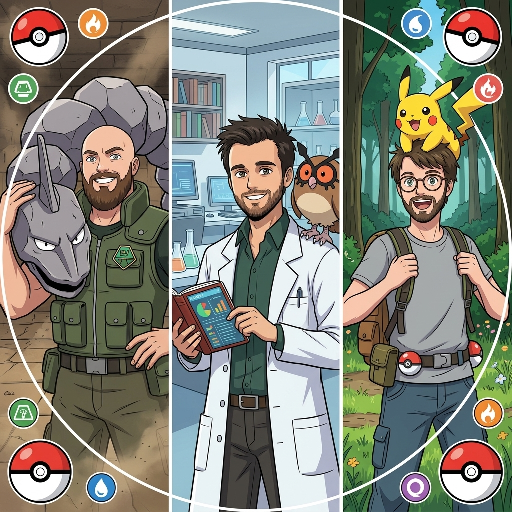
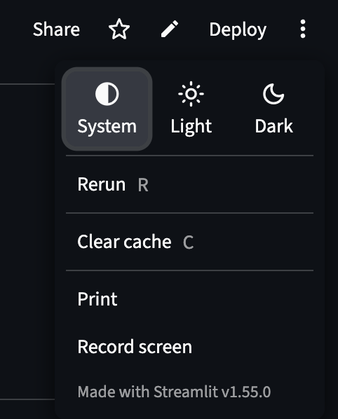
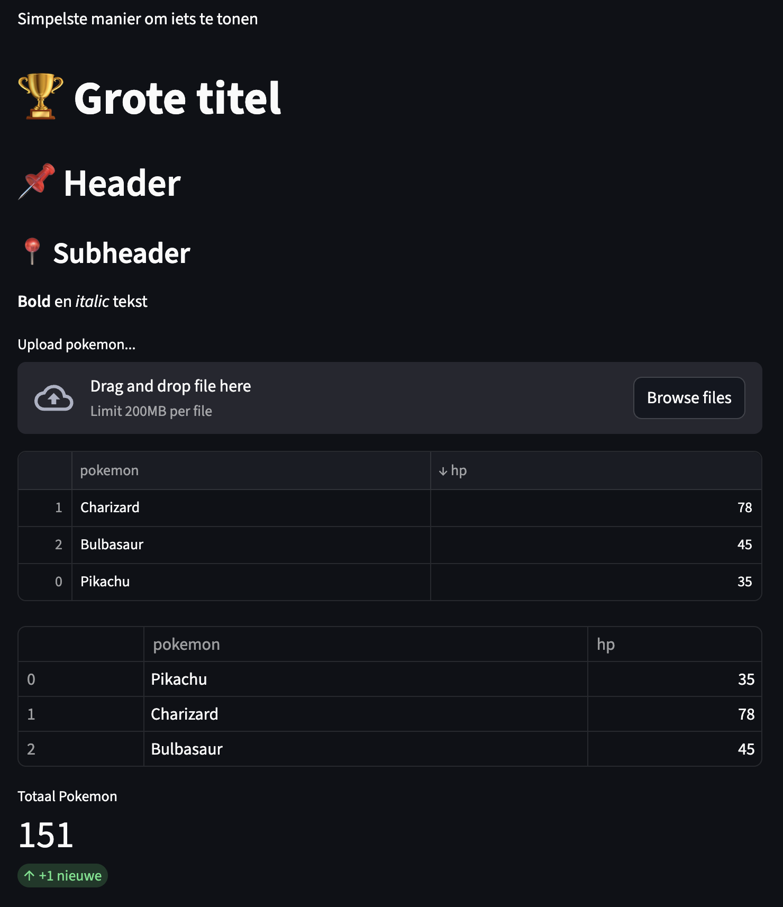
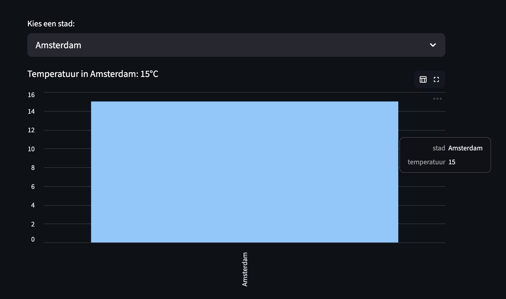
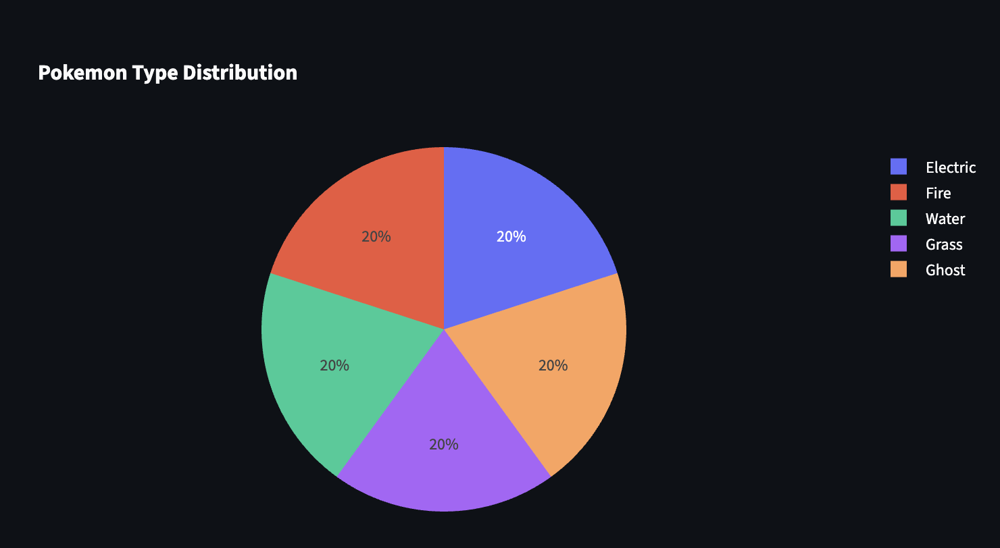
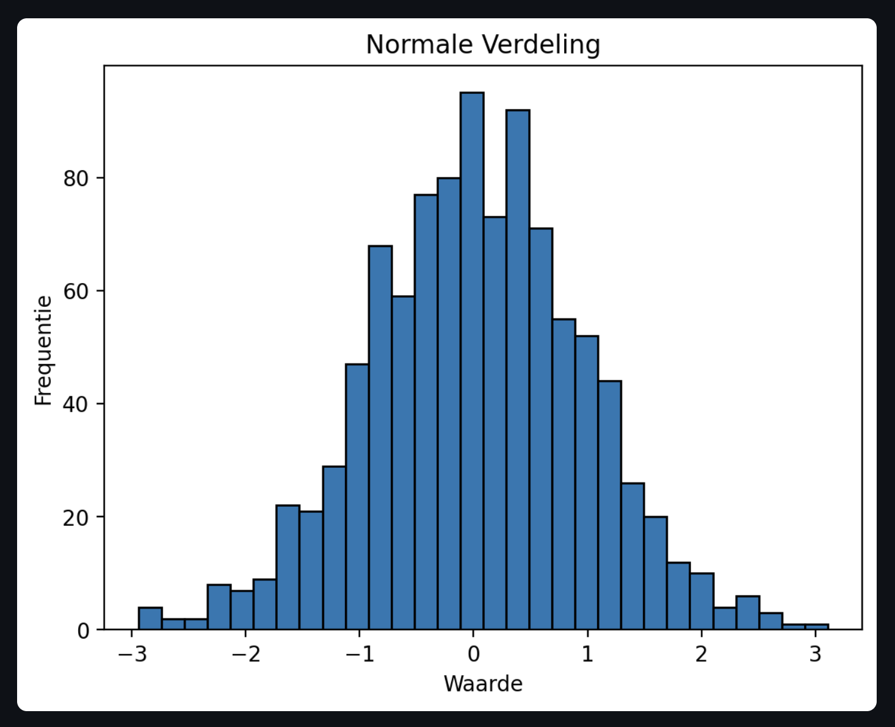
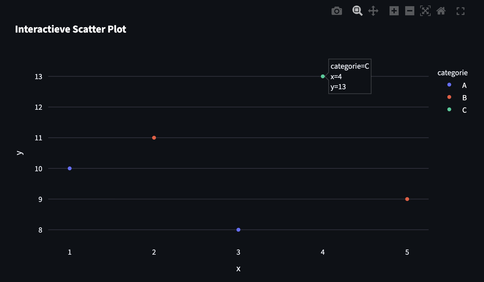
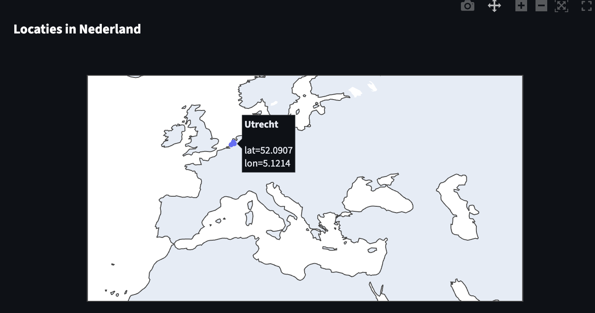

<h1 style="font-size: 2.5rem;">Streamlit: Snel & Makkelijk Visualiseren</h1>

<h3 style="font-size: 1.2rem;">Deel 1: Overzicht van Streamlit</h3>

<div style="display: flex; justify-content: center; align-items: center; gap: 5vw; font-size: 1.1rem; flex-wrap: wrap;">
  <div style="text-align: center;">
    <strong>Dervis van Leersum</strong><br>
    <i>Pokemon Gym Leader</i>
  </div>
  <div style="text-align: center;">
    <strong>Dennis Stoel</strong><br>
    <i>Pokemon Professor</i>
  </div>
  <div style="text-align: center;">
    <strong>Sander Kools</strong><br>
    <i>Pokemon Trainer</i>
  </div>
</div>

<div style="text-align: center;">
  
</div>

<div style="text-align: center;">
  
</div>

---

## Programma van vandaag

<div style="font-size: 1.5rem; margin: 4vh 0; text-align: left; max-width: 700px; margin-left: auto; margin-right: auto;">

| # | Onderdeel |
|---|-----------|
| 1 | 📖 **Presentatie** — Streamlit basics |
| 2 | 💻 **Opdracht 1** |
| 3 | 💬 **Bespreking** |
| 4 | 📖 **Presentatie 2** — Meer in-depth & interactie |
| 5 | 💻 **Opdracht 2** |
| 6 | 💬 **Bespreking** |
| 7 | 📖 **Presentatie 3** — Advanced topics |
| 8 | 🏆 **Eindopdracht** — *er valt iets te winnen!* |
| 9 | 🥇 **Bekendmaking** winnaar |
| 10 | 🍻 **Borrel** |

</div>

---

## Wat is Streamlit?

**Een Python framework om data scripts om te zetten in interactieve web apps**

<div style="font-size: 1.1rem; margin: 8vh 0; text-align: left;">

📚 **Streamlit Python-bibliotheek** — snel interactieve visualisaties en analyses<br>
📊 **Geen HTML, CSS of JavaScript nodig** — focus op data en logica<br>
⚡ **Van script naar shareable app in minuten** — gemak<br>
🐍 **Pure Python** — gebruik je bestaande skills<br>
🔄 **Live updates** — elke code wijziging direct zichtbaar

</div>

<div style="font-size: 1.1rem; font-style: italic; text-align: center; margin-top: 4vh;">

> *"If you can write Python, you can build a web app"*

</div>

---

## Waarom Streamlit?

<div style="font-size: 0.45em; margin: 50px 0px 0px 0px; text-align: left;">

### 👨‍🔬 **Voor Data Scientists**

- Snel een prototype model kunnen tonen aan stakeholders
- Exploratory data analysis delen met collega's
- Geen wachten op frontend developers 😶

</div>
<div style="font-size: 0.45em; margin: 30px 0px 0px 0px; text-align: left;">

### 👨‍💻 **Voor Software Engineers**  

- Interne tools & dashboards in uren i.p.v. weken
- MVPs en proof-of-concepts
- Admin panels zonder React/Vue/Angular

</div>
<div style="font-size: 0.45em; margin: 30px 0px 40px 0px; text-align: left;">

### 👥 **Voor Teams**

- Beheer data access (iedereen kan je analyses gebruiken)
- Live demos tijdens meetings
- Self-service analytics platforms

</div>
<div style="font-size: 0.55em;">

> ✅ **Perfect voor:** Internal tools, data apps, demos, prototypes, MVPs

</div>

---

## Bijvoorbeeld
<br>

<table>
<tr>
<td style="width: 50%; vertical-align: top; padding: 10px;">
Snippet
</td>
<td style="width: 40%; vertical-align: top; padding: 10px;">
Result
</td>
</tr>
<tr>
<td style="width: 40%; vertical-align: top; padding: 10px;">

##### 📝 Code:
```python
import streamlit as st
st.title("Hallo, Streamlit!")
st.line_chart([1, 2, 3, 4, 5])
```

##### 🏃 Run app:
```bash
streamlit run app.py
```

</td>
<td style="width: 40%; vertical-align: top; padding: 10px;">

<div style="flex: 1; text-align: center;">
  
</div>

</td>
</tr>
</table>

---

## ⚠️ Wanneer NIET Streamlit?

<div style="font-size: 0.7em; margin: 60px 0px 60px 0px; text-align: left;">

❌ **High-traffic publieke apps** (veel concurrent users)  
❌ **Complexe state management** (multi-user real-time collaboration)  
❌ **Pixel-perfect custom UI** (complexe design specs)  
❌ **Mobile-first apps** (responsive, maar niet optimaal)

</div>

---

## Streamlit Execution Model
#### *Dit is CRUCIAAL om te begrijpen!*

<div style="font-size: 0.8em; margin: 40px 0px 40px 0px; text-align: left;">

#### ⚡ Het Belangrijkste Principe:

</div>
<div style="font-size: 0.6em;">

> **Streamlit re-runs je hele script bij elke interactie**  
> Van boven naar beneden, telkens opnieuw

</div>
<div style="font-size: 0.8em; margin: 40px 0px 40px 0px; text-align: left;">

🖱️ **Elke widget click** = complete re-run  
⌨️ **Elke input change** = complete re-run  
📁 **Elke file upload** = complete re-run  

</div>
<div style="font-size: 0.4em; margin: 40px 0px 10px 0px;;">

> Meer hierover in de volgende presentatie...

</div>

---

## 🚀 Start met Streamlit

<div style="font-size: 0.65em; margin: 30px 0px 0px 0px;">

### 📦 **Installatie**
```bash
uv sync
```

</div>
<div style="font-size: 0.65em; margin: 30px 0px 0px 0px;">

### 📝 **Maak een module:** `app.py`
```python
import streamlit as st

st.write("Hallo workshop! 👋")
```

</div>
<div style="font-size: 0.65em; margin: 30px 0px 0px 0px;">

### ▶️ **Run het**
```bash
uv run streamlit run app.py
```

</div>
<div style="font-size: 0.65em; margin: 50px 0px 0px 0px;">

**Browser opent (automatisch) op** `http://localhost:8501` 🎉

</div>


---

### 🏗️ Architectuur Basics

<div style="font-size: 0.7em; margin: 30px 0px;">

<table style="width: 100%; border-collapse: separate; border-spacing: 20px;">
<tr>
<td style="width: 40%; background: #2779d6; padding: 30px; border-radius: 10px; border: 2px solid #4a90e2;">

### 🌐 **Browser (Frontend)**

<div style="font-size: 0.9em; margin-top: 20px; text-align: left;">

✨ UI Rendering  
⌨️ User Input  
🖱️ Interactivity  
📱 Responsive Layout  

</div>

</td>

<td style="width: 20%; text-align: center; vertical-align: middle; font-size: 2em;">

**↔️**

<div style="font-size: 0.4em; margin-top: 10px;">
WebSocket
</div>

</td>

<td style="width: 40%; background: #c58d38; padding: 30px; border-radius: 10px; border: 2px solid #ff9800;">

### 🐍 **Python (Backend)**

<div style="font-size: 0.9em; margin-top: 20px; text-align: left;">

⚙️ Script Execution  
🧮 Data Processing  
💾 State Management  
📊 Compute Work  

</div>

</td>
</tr>
</table>

🔌 **WebSocket verbinding:** real-time updates  
🖥️ **Server-side rendering:** Python doet het zware werk  
📡 **Auto-reconnect:** verbinding verloren? Herstelt automatisch  

💡 **Voor jou:** Schrijf gewoon Python, Streamlit regelt de rest!

</div>

---

### The App Chrome

<table>
<tr>
<td style="width: 50%; vertical-align: top; padding: 10px;">
Built-in dev tools
</td>
<td style="font-size: 0.55em; width: 40%; padding: 10px;">
in the top right corner
</td>
</tr>
<tr>
<td style="font-size: 0.55em; width: 40%; vertical-align: top; padding: 10px;">

⚙️ **Settings** 
  * theme, run on save, wide mode

🔄 **Rerun** 
  * handmatig hertrigger

🗑️ **Clear cache** 
  * verwijder gecachte data

📹 **Record screencast** 
  * maak een demo video

🐛 **Print** 
  * print de pagina

</td>
<td style="width: 40%; vertical-align: top; padding: 10px;">

<div style="flex: 1; text-align: center;">
  
</div>

</td>
</tr>
</table>

---

### 🧩 Core Widgets - display & Input

<table>
<tr>
<td style="width: 50%; vertical-align: top; padding: 10px;">
📊 Data Weergeven
</td>
<td style="font-size: 0.55em; width: 40%; padding: 10px;">

</td>
</tr>
<tr>
<td style="font-size: 0.55em; width: 40%; vertical-align: top; padding: 10px;">

```python
import streamlit as st
import pandas as pd

# Text
st.write("Simpelste manier om iets te tonen")
st.title("🏆 Grote titel")
st.header("📌 Header")
st.subheader("📍 Subheader")
st.markdown("**Bold** en *italic* tekst")

# ✨ Magic!
st.file_uploader("Upload pokemon...")

# Data
df = pd.DataFrame(
  {
    "pokemon": ["Pikachu", "Charizard", "Bulbasaur"], 
    "hp": [35, 78, 45]
  }
)
st.dataframe(df)  # 📊 Interactieve tabel (sorteerbaar!)
st.table(df)      # 📋 Static tabel

# Metrics: 📈 Met delta
st.metric("Totaal Pokemon", "151", "+1 nieuwe")
```
</td>
<td style="width: 40%; vertical-align: top; padding: 10px;">

<div style="flex: 1; text-align: center;">
  
</div>

</td>
</tr>
</table>
---

### 🧩 Core Widgets - Visualize

<table>
<tr>
<td style="width: 50%; vertical-align: top; padding: 10px;">
📊 Bar Chart
</td>
<td style="font-size: 0.55em; width: 40%; padding: 10px;">

</td>
</tr>
<tr>
<td style="font-size: 0.55em; width: 40%; vertical-align: top; padding: 10px;">

```python
import streamlit as st
import pandas as pd

# Create DataFrame
data = pd.DataFrame({
    "stad": [
      "Amsterdam", "Rotterdam", "Utrecht", "Eindhoven"
    ],
    "temperatuur": [15, 17, 14, 16]
})

# Create a dropdown box
selected_city = st.selectbox(
    "Kies een stad:",
    data["stad"].unique()
)
# filter on selection
filtered_data = data[data["stad"] == selected_city]

st.write(
    f"Temperatuur in {selected_city}: {
        filtered_data['temperatuur'].values[0]
    }°C"
)
# Plot a bar chart
st.bar_chart(filtered_data.set_index("stad"))
```
</td>
<td style="width: 40%; vertical-align: top; padding: 10px;">

<div style="flex: 1; text-align: center;">
  
</div>

</td>
</tr>
</table>

---

### 🧩 Core Widgets - Visualize

<table>
<tr>
<td style="width: 50%; vertical-align: top; padding: 10px;">
🥧 Pie Chart
</td>
<td style="font-size: 0.55em; width: 40%; padding: 10px;">

</td>
</tr>
<tr>
<td style="font-size: 0.55em; width: 40%; vertical-align: top; padding: 10px;">

```python
# Voorbeeld Pokemon data
df = pd.DataFrame({
    "pokemon": [
      "Pikachu", "Charizard",
      "Blastoise", "Venusaur", "Gengar"
    ],
    "attack": [55, 84, 83, 82, 65],
    "defense": [40, 78, 100, 83, 60],
    "speed": [90, 100, 78, 80, 110],
    "type": [
      "Electric", "Fire", "Water", "Grass", "Ghost"
    ],
    "hp": [35, 78, 79, 80, 60]
})

# 🥧 Pie Chart - Type Distribution
type_counts = df["type"].value_counts().reset_index()
type_counts.columns = ["type", "count"]
fig_pie = px.pie(
    type_counts,
    values="count",
    names="type",
    title="Pokemon Type Distribution"
)
st.plotly_chart(fig_pie, width="stretch")
```
</td>
<td style="width: 40%; vertical-align: top; padding: 10px;">

<div style="flex: 1; text-align: center;">
  
</div>

</td>
</tr>
</table>

---

### 🧩 Core Widgets - Visualize

<table>
<tr>
<td style="width: 50%; vertical-align: top; padding: 10px;">
📊 Matplotlib
</td>
<td style="font-size: 0.55em; width: 40%; padding: 10px;">

</td>
</tr>
<tr>
<td style="font-size: 0.55em; width: 40%; vertical-align: top; padding: 10px;">

```python
import streamlit as st
import matplotlib.pyplot as plt
import numpy as np

# Genereer willekeurige data
data = np.random.normal(0, 1, 1000)

# Maak een histogram
fig, ax = plt.subplots()
ax.hist(data, bins=30, edgecolor='black')
ax.set_title("Normale Verdeling")
ax.set_xlabel("Waarde")
ax.set_ylabel("Frequentie")

# Toon de grafiek in Streamlit
st.pyplot(fig)
```
</td>
<td style="width: 40%; vertical-align: top; padding: 10px;">

<div style="flex: 1; text-align: center;">
  
</div>

</td>
</tr>
</table>

---

### 🧩 Core Widgets - Visualize

<table>
<tr>
<td style="width: 50%; vertical-align: top; padding: 10px;">
📊 Plotly
</td>
<td style="font-size: 0.55em; width: 40%; padding: 10px;">

</td>
</tr>
<tr>
<td style="font-size: 0.55em; width: 40%; vertical-align: top; padding: 10px;">

```python
import streamlit as st
import plotly.express as px
import pandas as pd

# Voorbeeld data
df = pd.DataFrame({
    "x": [1, 2, 3, 4, 5],
    "y": [10, 11, 8, 13, 9],
    "categorie": ["A", "B", "A", "C", "B"]
})

# Maak een interactieve scatter plot
fig = px.scatter(
  df,
  x="x", y="y", 
  color="categorie",
  title="Interactieve Scatter Plot"
)

# Toon de grafiek in Streamlit
st.plotly_chart(fig)
```
</td>
<td style="width: 40%; vertical-align: top; padding: 10px;">

<div style="flex: 1; text-align: center;">
  
</div>

</td>
</tr>
</table>

---

### 🧩 Core Widgets - Visualize

<table>
<tr>
<td style="width: 50%; vertical-align: top; padding: 10px;">
📊 GeoPlots
</td>
<td style="font-size: 0.55em; width: 40%; padding: 10px;">

</td>
</tr>
<tr>
<td style="font-size: 0.55em; width: 40%; vertical-align: top; padding: 10px;">

```python
import streamlit as st
import pandas as pd
import plotly.express as px

# Voorbeeld data met locaties
df = pd.DataFrame({
    "stad": ["Amsterdam", "Rotterdam", "Utrecht"],
    "lat": [52.3676, 51.9244, 52.0907],
    "lon": [4.9041, 4.4777, 5.1214]
})

# Maak een kaart met Plotly
fig = px.scatter_geo(
    df,
    lat="lat",
    lon="lon",
    hover_name="stad",
    title="Locaties in Nederland",
    projection="natural earth"
)

# Toon de kaart in Streamlit
st.plotly_chart(fig)
```
</td>
<td style="width: 40%; vertical-align: top; padding: 10px;">

<div style="flex: 1; text-align: center;">
  
</div>

</td>
</tr>
</table>

---

### 🎯 Opdracht 1: Aan de slag met Streamlit

<div style="font-size: 0.75em; margin: 40px 0px 60px 0px; line-height: 1.5; text-align: left;">

### Wat gaan we doen?
1. 📡 **Dataset Inladen** - Overview van Pokemon
2. 📊 **Data Preview** - Interactieve tabel met alle Pokemon
3. 👩‍🎨 **Visualisaties** - Type distribution, stats, plots, charts

</div>
<div style="font-size: 0.7em; margin: 60px 0px 60px 0px; line-height: 1.5; text-align: left;">

📁 Innersource: Starter code staat klaar in branch `exercise-1`

```bash
git checkout exercise-1
uv run streamlit run app.py
```

</div>

---

## 💡 Tips Voordat Je Begint

<div style="font-size: 0.65em; margin: 30px 0px; text-align: left;">

### 🐛 **Debugging**
```python
st.write("Debug:", variable)  # Simpelste debug tool
st.json(data)                 # JSON data inspecteren
st.dataframe(df)              # Dataframe inspecteren
```

</div>
<div style="font-size: 0.65em; margin: 30px 0px; text-align: left;">

### 📚 **Hulp Nodig?**

- 📖 **Streamlit docs:** [docs.streamlit.io](https://docs.streamlit.io)
- 🎨 **Widget gallery:** Zoek naar "streamlit components"
- 👥 **Je collega's!** Pair programming encouraged
- 🙋 **Trainers:** Sander, Dennis, Dervis

</div>
<div style="font-size: 0.65em; margin: 30px 0px; text-align: left;">

### 🔄 **Hot Reload**

Wijzig code → Save → **"Rerun" knop verschijnt** → Click!

</div>

---

<div style="text-align: center; padding: 2em 0;">

## Einde Deel 1

<div style="margin-top: 2em; display: flex; gap: 1.5em; justify-content: center; flex-wrap: wrap;">
  <a href="presentation_2.html" style="padding: 0.7em 1.4em; background: #e94560; color: white; border-radius: 8px; text-decoration: none; font-size: 1em; font-weight: 600;">➡️ Deel 2</a>
  <a href="index.html" style="padding: 0.7em 1.4em; background: #0f3460; color: #c0d0e0; border-radius: 8px; text-decoration: none; font-size: 1em; font-weight: 600;">🏠 Index</a>
</div>

</div>
