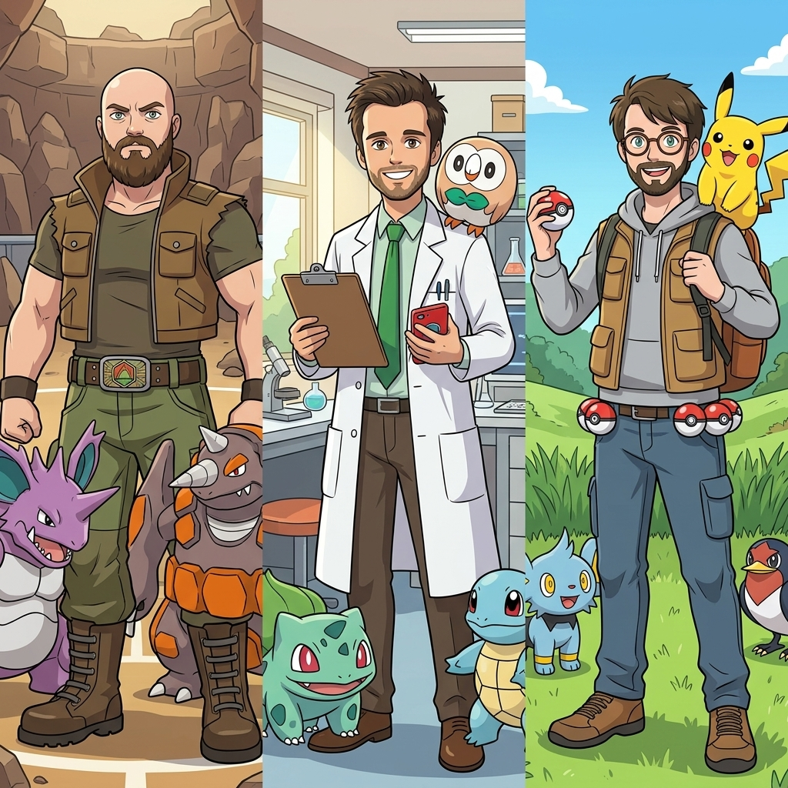
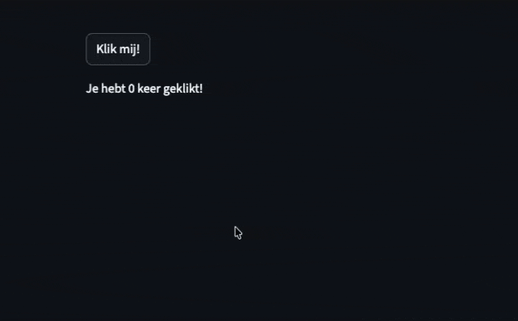
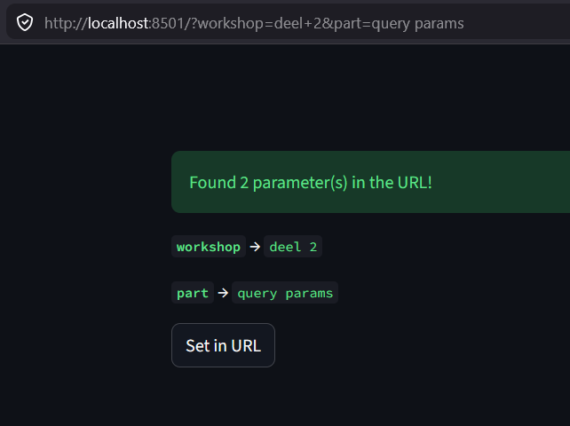
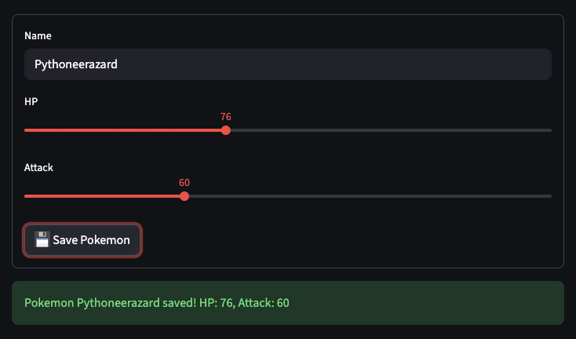
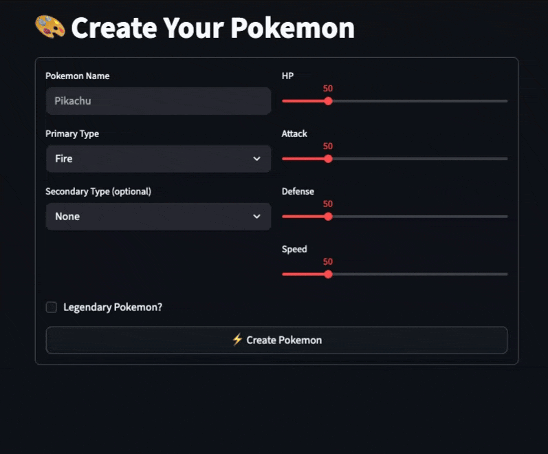
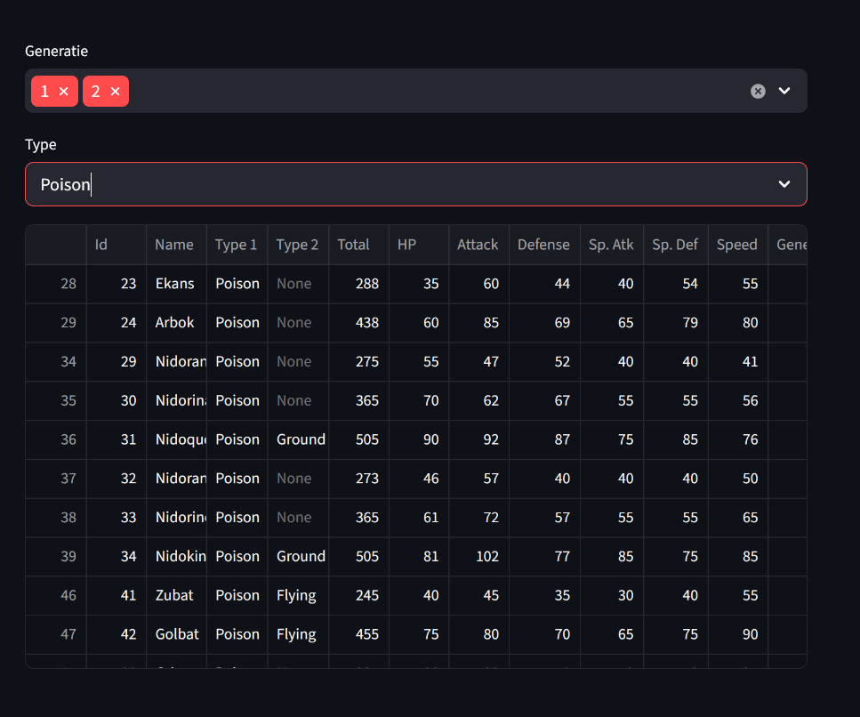
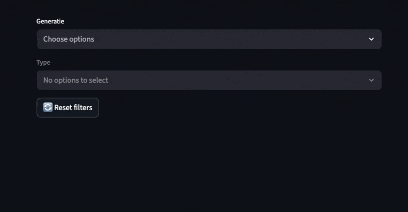
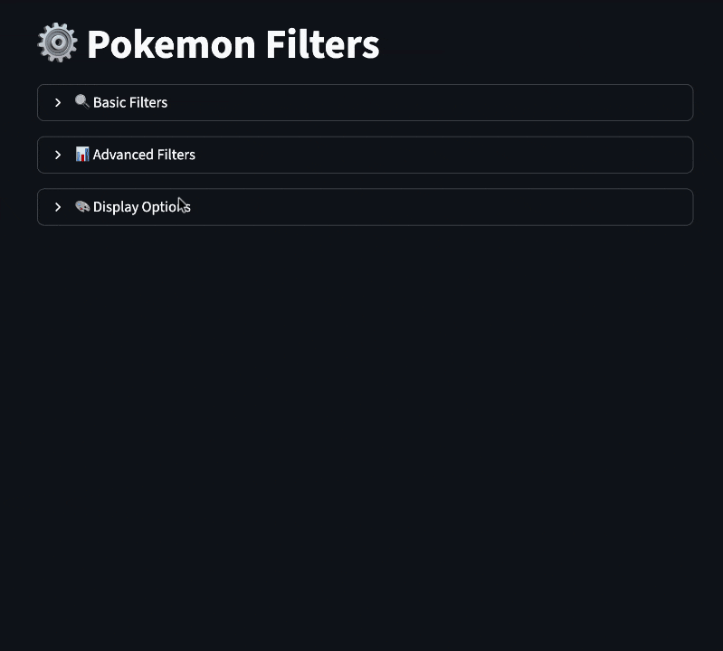

<h1 style="font-size: 1.3em;">Streamlit: Meer dan de basics</h1>

<h3 style="font-size: 0.8em;">Deel 2: Interactie met je data</h3>

<div style="text-align: center;">
  
</div>

---

## 🔄 Recap: Het Probleem

<div style="font-size: 0.65em; margin: 30px 0px;">

### 😢 **Herinner je dit uit Deel 1?**
```python
import streamlit as st

count = 0  # Reset bij elke rerun!

if st.button("➕ Klik me"):
    count += 1

st.write(f"Count: {count}")  # Nooit voorbij 1!
```

<br>

### 🤔 **Het Probleem:**

Bij elke interactie draait Streamlit je **hele script opnieuw**.  
Alle variabelen worden **gereset**.

<br>

### 💡 **De Oplossing: Session State!**

</div>

---

### 🎯 Session State - De Oplossing

<div style="font-size: 0.65em; margin: 30px 0px;">

### ✅ **Dit werkt WEL!**
```python
import streamlit as st

# Initialiseer in session state
if 'count' not in st.session_state:
    st.session_state.count = 0

# Button update
if st.button("➕ Klik me"):
    st.session_state.count += 1

st.write(f"Count: {st.session_state.count}")  # Blijft tellen! 🎉
```

<br>

### 🔑 **Key Concept:**

</div>
<div style="font-size: 0.5em; margin: 30px 0px;">

> `st.session_state` is een **dictionary** die **persistent** is tussen reruns!

</div>

---

## 📝 Session State Patterns

<div style="font-size: 0.7em; margin: 30px 0px;">

### 🔧 **Best Practices**
```python
# ✅ GOED: Check eerst of key bestaat
if "my_key" not in st.session_state:
    st.session_state.my_key = initial_value

# ✅ GOED: Direct toewijzen
st.session_state.pokemon = "Pikachu"

# ✅ GOED: Dictionary-style access
st.session_state["pokemon"] = "Pikachu"

# ❌ FOUT: Geen check, kan errors geven
value = st.session_state.maybe_doesnt_exist  # KeyError!

# ✅ GOED: Safe access met get()
value = st.session_state.get("maybe_doesnt_exist", "default")
```

</div>
<div style="font-size: 0.6em; margin: 30px 0px;">

#### Kortom:
* **Gebruikersinvoer**
* **Tussenresultaten**
* **App-status** (bijv. "ingelogd")

</div>

---

## 🧩 Teller met sessie beheer

📊 Voorbeeld

<table>
<tr>
<td style="width: 50%; vertical-align: top; padding: 10px;">

</td>
<td style="font-size: 0.55em; width: 40%; padding: 10px;">

</td>
</tr>
<tr>
<td style="font-size: 0.55em; width: 40%; vertical-align: top; padding: 10px;">

```python
import streamlit as st

# Initialiseer de teller als deze nog niet bestaat
if "count" not in st.session_state:
    st.session_state.count = 0

# Knop om de teller te verhogen
if st.button("Klik mij!"):
    st.session_state.count += 1

# Toon de huidige waarde
st.write(f"Je hebt {st.session_state.count} keer geklikt!")
```
</td>
<td style="width: 40%; vertical-align: top; padding: 10px;">

<div style="flex: 1; text-align: center;">
  
</div>

</td>
</tr>
</table>

---

## 🧩 Query Params

- Deel je app-state via de URL
- Herstel filters bij het openen van een link

<table>
<tr>
<td style="width: 50%; vertical-align: top; padding: 10px;">

</td>
<td style="font-size: 0.55em; width: 40%; padding: 10px;">

</td>
</tr>
<tr>
<td style="font-size: 0.55em; width: 40%; vertical-align: top; padding: 10px;">

```python
import streamlit as st

params = st.query_params

if params:
    st.success(
      f"Found {len(params)} parameter(s) in the URL!"
    )
    
    for key, value in params.items():
        st.write(f"**`{key}`** → `{value}`")

if st.button("Set in URL"):
    st.query_params["new_param"] = "value"
    st.rerun()
```
</td>
<td style="width: 40%; vertical-align: top; padding: 10px;">

<div style="flex: 1; text-align: center;">
  
</div>

</td>
</tr>
</table>

---

### 🧩 Forms

<div style="font-size: 0.6em; margin: 20px 0px;">

- Batch updates
- Groepeer inputs voor betere UX
- Voorkom onnodige reruns

</div>
<table>
<tr>
<td style="width: 50%; vertical-align: top; padding: 10px;">

</td>
<td style="font-size: 0.65em; width: 40%; padding: 10px;">

</td>
</tr>
<tr>
<td style="font-size: 0.50em; width: 40%; vertical-align: top; padding: 10px;">

#### 😫 **Het Probleem:**
```python
# Elke widget = rerun!
name = st.text_input("Name")      # Rerun bij elke letter!
hp = st.slider("HP", 0, 200)      # Rerun bij elke wijziging!
attack = st.slider("Attack", 0, 200)  # Rerun!
```

→ 3 widgets = potentieel 100+ reruns terwijl je invult! 😱

<br>

#### ✅ **De Oplossing: Forms**
```python
with st.form("pokemon_form"):
    name = st.text_input("Name")
    hp = st.slider("HP", 0, 200)
    attack = st.slider("Attack", 0, 200)
    
    submitted = st.form_submit_button("💾 Save Pokemon")
    
if submitted:
    st.success(
      f"Pokemon {name} saved! HP: {hp}, Attack: {attack}"
    )
    # Slechts 1 rerun bij submit!
```
<td style="width: 40%; vertical-align: top; padding: 10px;">

<div style="flex: 1; text-align: center;">
  
</div>

</td>
</tr>
</table>

---

#### 🧩 Forms - voorbeeld

<div style="display: flex; font-size: 0.6em; margin: 20px 0px; justify-content: center;">

</div>

---

## 🧩 Filters

<div style="font-size: 0.6em; margin: 20px 0px;">

1. Filter op generatie → updates beschikbare types
2. Filter op type → updates beschikbare Pokémon

</div>
<table>
<tr>
<td style="width: 50%; vertical-align: top; padding: 10px;">

</td>
<td style="font-size: 0.55em; width: 40%; padding: 10px;">

</td>
</tr>
<tr>
<td style="font-size: 0.45em; width: 40%; vertical-align: top; padding: 10px;">

```python
# Load and cache data
@st.cache_data
def load_data():
    csv_path = 'Pokemon_Stats.csv'
    return pd.read_csv(csv_path)

pokemon_df = load_data()

generations = st.multiselect("Generatie", [1, 2, 3])

# Filter by generation, or use all if none selected
filtered_by_gen = (
    pokemon_df[pokemon_df["Generation"].isin(generations)]
    if generations
    else pokemon_df
)

types = ["All"] + filtered_by_gen["Type 1"].unique().tolist()
selected_type = st.selectbox("Type", types)

# Filter by type, or use all if "All" selected
filtered_df = (
  filtered_by_gen
  if selected_type == "All"
  else filtered_by_gen[filtered_by_gen["Type 1"] == selected_type]
)

# Present filtered data
st.dataframe(filtered_df)
```
</td>
<td style="width: 40%; vertical-align: top; padding: 10px;">

<div style="flex: 1; text-align: center;">
  
</div>

</td>
</tr>
</table>

---

### 🧩 Cascading Filters 
##### dynamisch updaten

<div style="font-size: 0.6em; margin: 20px 0px;">

- Gebruik `on_change` om filters direct te updaten:

</div>
<table>
<tr>
<td style="width: 50%; vertical-align: top; padding: 10px;">

</td>
<td style="font-size: 0.55em; width: 40%; padding: 10px;">

</td>
</tr>
<tr>
<td style="font-size: 0.40em; width: 20%; vertical-align: top; padding: 10px;">

```python
# Load data
@st.cache_data
def load_data():
    csv_path = 'Pokemon_Stats.csv'
    return pd.read_csv(csv_path)

pokemon_df = load_data()

def update_types():
  st.session_state.types = (
    pokemon_df[pokemon_df["Generation"]
      .isin(st.session_state.generations)]["Type 1"]
      .unique()
      .tolist()
  )

def reset_filters():
  st.session_state.generations = []
  st.session_state.types = []
  st.session_state.type = None

st.multiselect(
  "Generatie",
  [1, 2, 3, 4, 5, 6, 7],
  key="generations",
  on_change=update_types
)
st.selectbox(
  "Type",
  st.session_state.get("types", []),
  key="type"
)
st.button(
  "🔄 Reset filters",
  on_click=reset_filters  # on_click is on_change voor buttons
)
```
</td>
<td style="width: 55%; vertical-align: top; padding: 10px;">
<div style="flex: 1; text-align: center;">

</div>
</td>
</tr>
</table>

---

### 🧩 UX: Collapsible Filter Sections

#### 📂 **Organiseer complexe UI**

<table>
<tr>
<td style="width: 50%; vertical-align: top; padding: 10px;">

</td>
<td style="font-size: 0.55em; width: 40%; padding: 10px;">

</td>
</tr>
<tr>
<td style="font-size: 0.50em; width: 40%; vertical-align: top; padding: 10px;">

```python
import streamlit as st

st.title("⚙️ Pokemon Filters")

with st.expander("🔍 Basic Filters", expanded=True):
    pokemon_type = st.selectbox(
      "Type", ["Fire", "Water", "Grass"]
    )
    generation = st.slider(
      "Generation", 1, 9, (1, 3)
    )

with st.expander("📊 Advanced Filters"):
    min_hp = st.number_input("Minimum HP", 0, 255, 50)
    min_attack = st.number_input(
      "Minimum Attack", 0, 255, 50
    )
    only_legendary = st.checkbox("Only Legendaries")

with st.expander("🎨 Display Options"):
    show_images = st.checkbox("Show Pokemon Sprites", True)
    items_per_page = st.slider(
      "Items per page", 10, 100, 20
    )
```

</td>
<td style="width: 40%; vertical-align: top; padding: 10px;">
<div style="flex: 1; text-align: center;">
  
</div>

</td>
</tr>
</table>

---

### 💾 Caching - Performance Boost

<div style="font-size: 0.7em; margin: 30px 0px;">

### ⚡ **Het Probleem:**

Elke rerun = heel script opnieuw = **dure operaties telkens herhalen**
```python
import pandas as pd
import streamlit as st

# ❌ SLECHT: Laadt 800 Pokemon bij ELKE interactie!
df = pd.read_csv("pokemon.csv")  # Kost tijd...

pokemon_type = st.selectbox("Type", df['type'].unique())
# Zelfs als je alleen type wijzigt, laadt CSV opnieuw!
```

<br>

### 💡 **De Oplossing: Caching!**

Streamlit onthoudt het resultaat, hergebruikt het bij volgende runs.

</div>

---

### 🚀 @st.cache_data

<div style="font-size: 0.65em; margin: 20px 0px;">

### 📊 **Voor Data** (DataFrames, Lists, Dicts)
```python
import streamlit as st
import pandas as pd

@st.cache_data  # ⭐ De magic decorator!
def load_pokemon_data():
    """Laadt Pokemon data - wordt maar 1x uitgevoerd!"""
    df = pd.read_csv("pokemon.csv")  # Dure operatie
    return df

# Eerste keer: laadt van CSV (traag)
# Daarna: haalt uit cache (supersnel!)
df = load_pokemon_data()

st.write(f"Loaded {len(df)} Pokemon")  # Instant!
```

<br>

💡 **Gebruik voor:** CSV/Excel laden, data processing, API calls, DB acties, etc.

</div>

---

### 🔌 @st.cache_resource

<div style="font-size: 0.65em; margin: 20px 0px;">

### 🤖 **Voor Resources (Models, Connections, Objects)**
```python
import streamlit as st
from transformers import pipeline

@st.cache_resource  # Voor objecten die NIET gekopieerd moeten worden
def load_pokemon_classifier():
    """Laadt ML model - heavy operation!"""
    model = pipeline("text-classification")
    return model

# Model wordt 1x geladen, daarna hergebruikt
model = load_pokemon_classifier()

# Gebruik het model
pokemon_name = st.text_input("Describe a Pokemon:")
if pokemon_name:
    result = model(pokemon_name)
    st.write(result)
```

<br>

💡 **Gebruik voor:** ML models, database connections, API clients

</div>

---

## 🆚 Cache: Data vs Resource

<div style="font-size: 0.6em; margin: 30px 0px;">

<table style="width: 100%;">
<tr style="background: #b67979;">
<th>Feature</th>
<th>@st.cache_data</th>
<th>@st.cache_resource</th>
</tr>
<tr>
<td><strong>Gebruik voor</strong></td>
<td>DataFrames, lists, dicts, JSON</td>
<td>ML models, DB connections</td>
</tr>
<tr>
<td><strong>Retourneert</strong></td>
<td>📋 Kopie (nieuwe instance)</td>
<td>🔗 Zelfde object (reference)</td>
</tr>
<tr>
<td><strong>Thread-safe?</strong></td>
<td>✅ Ja (elke user krijgt kopie)</td>
<td>⚠️ Nee (shared tussen users)</td>
</tr>
<tr>
<td><strong>Voorbeeld</strong></td>
<td>pd.read_csv()</td>
<td>load_ml_model()</td>
</tr>
</table>

<br>

💡 **Vuistregel:** 
* Data kan veranderen? → `cache_data`
* Expensive object? → `cache_resource`

</div>

---

## ⏱️ Cache Invalidation

<div style="font-size: 0.7em; margin: 30px 0px;">

### 🔄 **Wanneer Wordt Cache Gecleared?**
```python
import streamlit as st
import pandas as pd
from datetime import datetime, timedelta

# Cache voor 1 uur
@st.cache_data(ttl=3600)  # Time-to-live in seconden
def load_pokemon_stats():
    return pd.read_csv("pokemon_stats.csv")

# Cache op basis van parameters
@st.cache_data
def get_pokemon_by_type(pokemon_type):
    # Andere type = andere cache entry
    df = pd.read_csv("pokemon.csv")
    return df[df['type'] == pokemon_type]

# Parameters veranderen? Nieuwe cache!
fire_pokemon = get_pokemon_by_type("Fire")    # Cache miss
fire_pokemon2 = get_pokemon_by_type("Fire")   # Cache hit! ⚡
water_pokemon = get_pokemon_by_type("Water")  # Cache miss (andere param)
```

</div>

---

### 🎨 Advanced Features Overview

<div style="font-size: 0.7em; margin: 30px 0px;">

### 🚀 **Meer Streamlit Goodies**

<div style="text-align: left; margin-left: 60px;">

🎯 **st.spinner()** - Loading indicator tijdens slow operations  
📊 **st.progress()** - Progress bar voor long tasks  
🎈 **st.balloons() / st.snow()** - Celebratory animations!  
📝 **st.toast()** - Temporary notification messages  
🔔 **st.success/info/warning/error()** - Colored alert boxes  
📸 **st.camera_input()** - Capture photos (Pokemon AR!)  
🎤 **st.audio_input()** - Record audio  
📍 **st.map()** - Display geospatial data  
🎨 **st.color_picker()** - Select colors (Pokemon type colors!)  

</div>

</div>

---

## ⚡ Tips

<div style="font-size: 0.7em; margin: 30px 0px;">

### 🏎️ **Maak je App Sneller**
```python
# ✅ GOED: Cache dure operaties
@st.cache_data
def load_data():
    return pd.read_csv("large_file.csv")

# ✅ GOED: Gebruik st.spinner voor UX
with st.spinner("Loading Pokemon data..."):
    df = load_expensive_data()

# ✅ GOED: Fragmenteer heavy visualizations
@st.fragment
def render_chart():
    # Alleen dit fragment rerun bij interactie
    st.plotly_chart(create_heavy_chart())

# ❌ SLECHT: Globale variabelen buiten functies
pokemon_df = pd.read_csv("pokemon.csv")  # Laadt bij elke rerun!

# ❌ SLECHT: Te veel widgets in een form (UX nightmare)
```

</div>

---

### 🚀 Deel 2: Aan de slag met Streamlit

<div style="font-size: 0.9em; margin: 60px 0px 60px 0px; line-height: 1.5; text-align: left;">

### Wat gaan we doen?
1. 📡 **Filters toepassen**
2. 📊 **Filterverwijzingen toevoegen**
3. 📉 **Meer knoppem**
4. 👩‍🎨 **Visualiseren**

</div>
<div style="font-size: 0.7em; margin: 60px 0px 60px 0px; line-height: 1.5; text-align: left;">

📁 InnerSource: Starter code staat klaar in branch `exercise-2`

```bash
git checkout exercise-2
uv run streamlit run app.py
```

</div>

---

<div style="text-align: center; padding: 2em 0;">

## Einde Deel 2

<div style="margin-top: 2em; display: flex; gap: 1.5em; justify-content: center; flex-wrap: wrap;">
  <a href="presentation_3.html" style="padding: 0.7em 1.4em; background: #e94560; color: white; border-radius: 8px; text-decoration: none; font-size: 1em; font-weight: 600;">➡️ Deel 3</a>
  <a href="index.html" style="padding: 0.7em 1.4em; background: #0f3460; color: #c0d0e0; border-radius: 8px; text-decoration: none; font-size: 1em; font-weight: 600;">🏠 Index</a>
</div>

</div>
