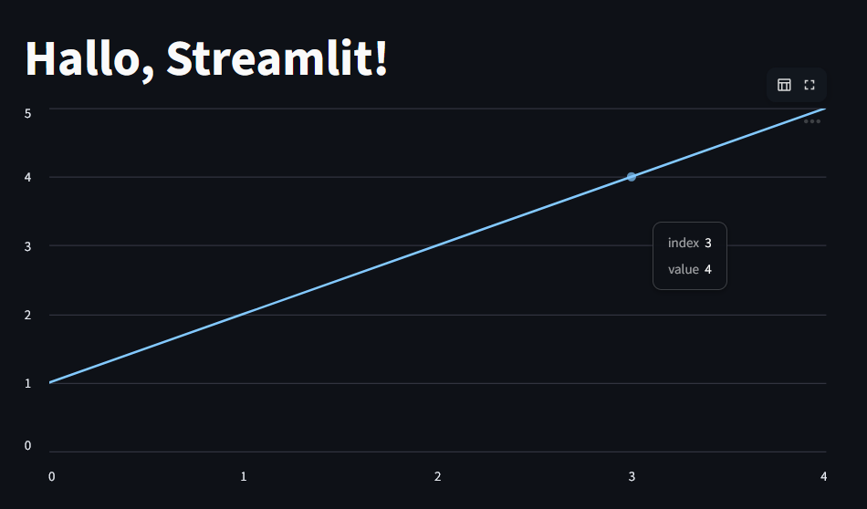

<h1 style="font-size: 2em;">Streamlit: Snel & Makkelijk Visualiseren</h1>

<h3 style="font-size: 1.2em;">Deel 1: Overzicht van Streamlit</h3>

<br>

<div style="display: flex; justify-content: center; gap: 20px; font-size: 0.8em;">
  <div>
    <strong>Sander Kools</strong><br>
    <i>Workshop Leider</i>
  </div>
  <div>
    <strong>Dennis Stoel</strong><br>
    <i>Helper</i>
  </div>
  <div>
    <strong>Dervis van Leersum</strong><br>
    <i>Helper</i>
  </div>
</div>

<br>

<div style="text-align: center;">
  
</div>

---

## Wat is Streamlit?

- **Streamlit** is een **Python-bibliotheek** om snel interactieve web-apps te bouwen voor data visualisatie en analyse.
- **Geen frontend-kennis nodig** – focus op je data en logica.
- **Out-of-the-box visualisaties** met minimale code.

---

<table>
<tr>
<td style="width: 60%; vertical-align: top; padding: 10px;">
Snippet
</td>
<td style="width: 40%; vertical-align: top; padding: 10px;">
Result
</td>
</tr>
<tr>
<td style="width: 60%; vertical-align: top; padding: 10px;">

```python
import streamlit as st
st.title("Hallo, Streamlit!")
st.line_chart([1, 2, 3, 4, 5])
```

</td>
<td style="width: 40%; vertical-align: top; padding: 10px;">

<div style="flex: 1; text-align: center;">
  
</div>

</td>
</tr>
</table>

---
## Sessiebeheer in Streamlit

### Wat is sessiebeheer?
Streamlit herlaadt de app bij elke interactie. Met **`st.session_state`** kun je data behouden tussen interacties, zoals:
- Gebruikersinvoer
- Tussenresultaten
- App-status (bijv. "ingelogd")

---

### Voorbeeld: Teller met Sessiebeheer
```python
import streamlit as st

# Initialiseer de teller als deze nog niet bestaat
if "count" not in st.session_state:
    st.session_state.count = 0

# Knop om de teller te verhogen
if st.button("Klik mij!"):
    st.session_state.count += 1

# Toon de huidige waarde
st.write(f"Je hebt {st.session_state.count} keer geklikt!")
```

---
## 🚀 Deel 1: Aan de slag met Streamlit

<div style="font-size: 0.95em; line-height: 1.5;">

### Wat gaan we doen?
- **Streamlit installeren en draaiend krijgen**
- **Sessiebeheer leren gebruiken**
- **Een lijn-grafiek maken met een weer-API**


---
## Filters in Streamlit

<div style="display: flex; flex-direction: column; font-size: 0.9em;">

<div style="margin-bottom: 10px;">
Wat zijn filters?
Filters laten gebruikers data selecteren, zoals:
- Steden
- Categorieën
- Opties uit een lijst
</div>

<div style="display: flex; justify-content: space-between; align-items: flex-start;">


```python
import streamlit as st
import pandas as pd

data = pd.DataFrame({
    "stad": ["Amsterdam", "Rotterdam", "Utrecht", "Eindhoven"],
    "temperatuur": [15, 17, 14, 16]
})
selected_city = st.selectbox(
    "Kies een stad:",
    data["stad"].unique()
)
filtered_data = data[data["stad"] == selected_city]

st.write(f"Temperatuur in {selected_city}: 
    {filtered_data['temperatuur'].values[0]}°C")
st.bar_chart(filtered_data.set_index("stad"))
```
---
## Matplotlib in Streamlit

<div style="display: flex; flex-direction: column; font-size: 0.9em;">

<div style="margin-bottom: 10px;">
Matplotlib is een krachtige bibliotheek voor het maken van **staatgrafieken, histograms, en scatter plots**. In Streamlit kun je Matplotlib-grafieken direct weergeven met `st.pyplot()`.
</div>

<div style="display: flex; justify-content: space-between; align-items: flex-start;">

<div style="flex: 1; padding-right: 10px;">

<div style="font-size: 0.75em; padding: 8px; border-radius: 4px;">

```python
import streamlit as st
import matplotlib.pyplot as plt
import numpy as np

# Genereer willekeurige data
data = np.random.normal(0, 1, 1000)

# Maak een histogram
fig, ax = plt.subplots()
ax.hist(data, bins=30, edgecolor='black')
ax.set_title("Normale Verdeling")
ax.set_xlabel("Waarde")
ax.set_ylabel("Frequentie")
# Toon de grafiek in Streamlit
st.pyplot(fig)
```
</div>
</div>
<div style="flex: 1; text-align: center;">
  
</div>
</div>
</div>
---

## Plotly in Streamlit

<div style="display: flex; flex-direction: column; font-size: 0.9em;">

Plotly is ideaal voor **interactieve visualisaties**, zoals 3D-plots, animaties, en geavanceerde grafieken. In Streamlit gebruik je `st.plotly_chart()` om Plotly-figuren weer te geven.
</div>

<div style="display: flex; justify-content: space-between; align-items: flex-start;">

<div style="width: 50%; flex: 1; padding-right: 10px;">

<div style="font-size: 0.75em; padding: 8px; border-radius: 4px;">

```python
import streamlit as st
import plotly.express as px
import pandas as pd

# Voorbeeld data
df = pd.DataFrame({
    "x": [1, 2, 3, 4, 5],
    "y": [10, 11, 8, 13, 9],
    "categorie": ["A", "B", "A", "C", "B"]
})

# Maak een interactieve scatter plot
fig = px.scatter(df, x="x", y="y", color="categorie", title="Interactieve Scatter Plot")

# Toon de grafiek in Streamlit
st.plotly_chart(fig)
```
</div>
</div>
<div style="width: 50%; flex: 1; text-align: center;">
  
</div>
</div>
</div>
---

## Geoplots in Streamlit

<div style="display: flex; flex-direction: column; font-size: 0.9em;">

<div style="margin-bottom: 10px;">

Geoplots zijn perfect voor het visualiseren van **geografische data**, zoals locaties op een kaart. Met bibliotheken zoals `folium` of `plotly.express` kun je eenvoudig kaarten toevoegen aan je Streamlit-app.
</div>

<div style="display: flex; justify-content: space-between; align-items: flex-start;">

<div style="font-size: 0.75em; background-color: padding: 8px; border-radius: 4px;">

```python
import streamlit as st
import pandas as pd
import plotly.express as px

# Voorbeeld data met locaties
df = pd.DataFrame({
    "stad": ["Amsterdam", "Rotterdam", "Utrecht"],
    "lat": [52.3676, 51.9244, 52.0907],
    "lon": [4.9041, 4.4777, 5.1214]
})

# Maak een kaart met Plotly
fig = px.scatter_geo(df,
                     lat="lat",
                     lon="lon",
                     hover_name="stad",
                     title="Locaties in Nederland",
                     projection="natural earth")

# Toon de kaart in Streamlit
st.plotly_chart(fig)
```
</div>
<div style="flex: 1; text-align: center;">
  
  <p style="font-size: 0.8em; color: #666;">Resultaat: Kaart met locaties</p>
</div>
</div>

---
## 🎨 Deel 2: Aan de slag met Geavanceerde Visualisaties!

<div style="font-size: 0.55em; line-height: 1.3; text-align: center;">

**Wat gaan we doen?**
Leer **complexe visualisaties** maken met:
- **Plotly** (interactieve grafieken)
- **Matplotlib** (histogrammen, staafdiagrammen)
- **Geoplots** (kaarten en geografische data)

**📌 Opdracht:**
1. Kies een dataset (bijv. weerdata, Pokémon API, gemeente data).
2. Maak een visualisatie met **Plotly of Matplotlib**.
3. Voeg **filters** toe (dropdowns, sliders).
4. Maak een kaart met geodata!

**💡 Tips:**
✅ **Vragen?** Roep ons!
✅ **Inspiratie nodig?** Kijk naar de voorbeelden.
✅ **Vastgelopen?** We helpen je graag!

**🚀 Tijd om te bouwen! Succes!** 🎉
</div>
---
